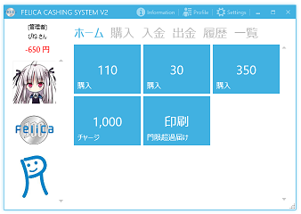
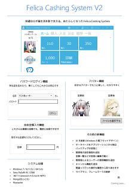

Felica Cashing System V2
========================
[](https://ci.appveyor.com/project/pine613/felicacashingsystemv2/branch/master)

## 概要
非接触 IC カード FeliCa を用いた組織内電子決済システムです。

|スクリーンショット|ポスター|
|------------------|--------|
|[](SS.png)|[](http://cdn.rawgit.com/pine613/FelicaCashingSystemV2/master/Poster.pdf)|

## 開発言語
- C#
- XAML

## 開発環境
- Windows 7 / 8.1
- Visual Studio 2013 Professional
- SONY PaSoRi RC-S380

## 利用しているライブラリ
- .NET Framework 4.5
  - Windows Forms (一部のみ)
  - WPF
- MashApps.Metro ([カスタマイズ版](https://github.com/pine613/MahApps.Metro/tree/felica_master) を使用)
- [MongoDB](http://www.mongodb.org) (v2.6)
- [iTextSharp](http://sourceforge.net/projects/itextsharp/)
- Adobe Acrobat 7.0 Browser Control Type Library 1.0
- PC/SC (WinScard.dll)
- NuGet
- [IPAex フォント](http://ipafont.ipa.go.jp)

## ビルド
ソリューションを Visual Studio で開き、構成を **Release** にしてビルドしてください。ビルドには、Adobe Reader と NuGet コマンドラインツール、及び PowerShell がインストールされている必要があります。

```
$ git clone https://github.com/pine613/FelicaCashingSystemV2.git
$ git clone https://github.com/pine613/FelicaCashingSystemV2_Settings.git

$ cd FelicaCashingSystemV2
$ git submodule update --init
$ powershell -NoProfile -ExecutionPolicy Unrestricted -File Build.ps1
```

ビルド時には、下記フォルダに IPAex フォント (ipaexm.ttf, ipaexg.ttf) が入っているように、事前にダウンロードしておいてください。

```
FelicaCashingSystemV2_Settings/KutDormitoryReport/KutDormitoryReport/KutDormitoryReport
```

## インストール
ビルド結果をインストール先にコピーしてください。

## 起動
FelicaCashingSystemV2.exe を実行してください。起動には、以下のソフトウェアが必要です。

- .NET Framework 4.5
- [Adobe Reader](http://www.adobe.com/jp/products/reader.html)
- [NFCポートソフトウェア](http://www.sony.co.jp/Products/felica/consumer/download/netinstaller.html)

接続先データベース (MongoDB) の設定は、FelicaCashingSystemV2.exe.config へ記述します。同一ホストで動作している場合、下記の通りになります (デフォルトのポート番号は 27017 です)。

```xml
<setting name="ConnectionString" serializeAs="String">
    <value>mongodb://localhost</value>
</setting>
```

別ホストや別ポートで動作している場合、以下のようになります。

```xml
<setting name="ConnectionString" serializeAs="String">
    <value>mongodb://192.168.0.32:20002</value>
</setting>
```

## 関係するプロジェクト
- [FelicaSharp](https://github.com/pine613/FelicaSharp)<br />
  カードリーダー (PaSoRi) を C# から利用するためのライブラリ
- [FelicaDataV2](https://github.com/pine613/FelicaDataV2)<br />
  Felica Cashing System V2 のデータベースレイヤを担当するモジュール
- [KutDormitoryReport](https://github.com/pine613/KutDormitoryReport)<br />
  高知工科大学ドミトリーの門限超過届けを自動発行する部分のモジュール
- [FelicaCashingSustemV2_Settings](https://github.com/pine613/FelicaCashingSystemV2_Settings)<br />
  Felica Cashing System V2 ビルド時に必要となる設定
- [RobotClubKut](https://github.com/RobotClubKut) / [FelicaCashingSystemV2_Settings](https://github.com/RobotClubKut/FelicaCashingSystemV2_Settings)<br />
  ロボット倶楽部で運用している Felica Cashing System V2 の設定 (非公開)